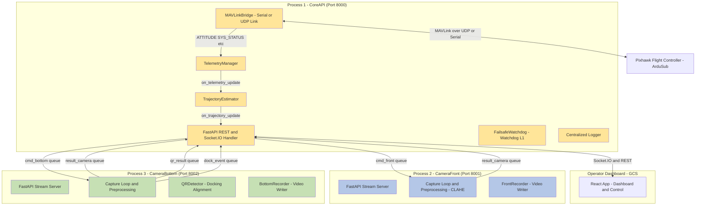
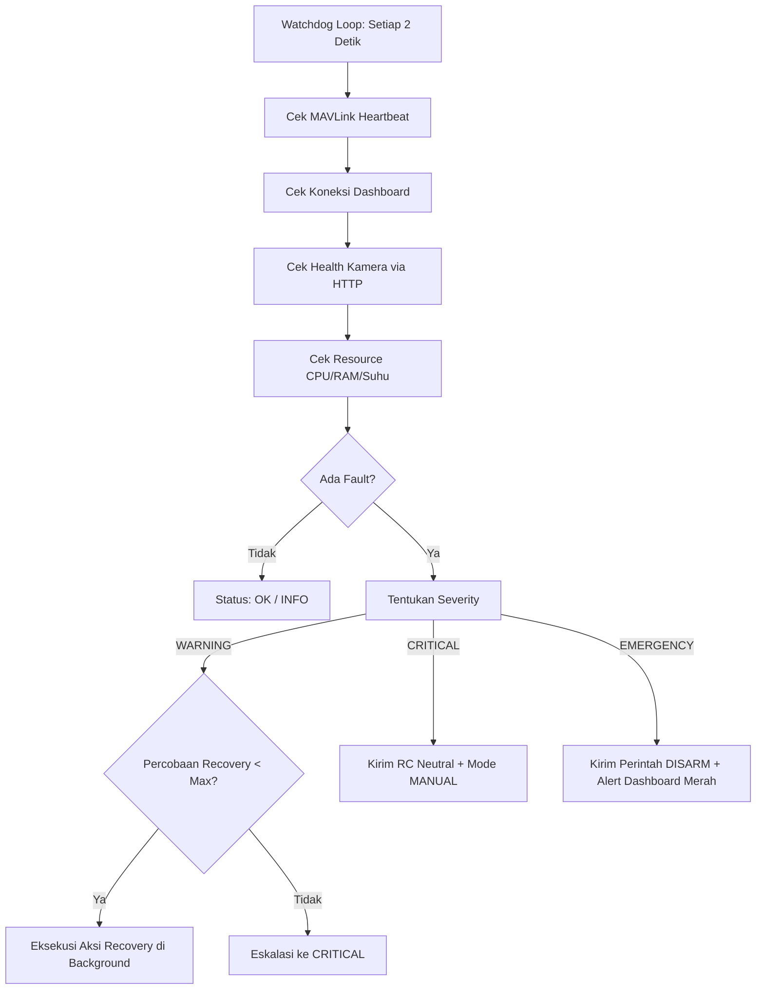

# Dokumentasi Sistem ROV Vision & Control

Dokumen ini ditujukan sebagai panduan teknis komprehensif bagi **Dosen Pembimbing**, **Divisi Elektronik**, **Embedded System Engineer**, **Frontend Engineer**, serta **Pengembang Penerus** sistem ROV. Dokumen ini menyajikan analisis mendalam tentang arsitektur perangkat lunak, spesifikasi hardware & protokol komunikasi, alur kerja sistem (*data flow*), detail antarmuka REST API & Socket.IO, sistem keamanan (*failsafe*), serta layanan logging terpusat.

---

## 1. Arsitektur Perangkat Lunak (Software Architecture)

Sistem dirancang dengan arsitektur **Multiprocessing** berbasis Python untuk memisahkan proses-proses kritis. Pemisahan ini mencegah latensi pemrosesan video berkecepatan tinggi mempengaruhi stabilitas kontrol wahana (ROV) dan pengiriman perintah MAVLink.

### 1.1. Diagram Blok Arsitektur Sistem



### 1.2. Pembagian Peran Komponen

#### 1. Proses CoreAPI (`main.py` -> `run_core_server`)
Proses utama yang mengendalikan siklus hidup ROV dan jembatan ke operator:
- **FastAPI & Socket.IO**: Melayani permintaan HTTP REST dan komunikasi dupleks penuh (*full-duplex*) berlatensi rendah ke dashboard operator React.
- **`MAVLinkBridge`**: Beroperasi di thread latar belakang untuk menjalin koneksi serial/UDP ke Pixhawk. Mengirimkan sinyal kendali seperti override RC channel (motor), arm/disarm, mode terbang, servo gripper, dan relay lampu.
- **`TelemetryManager`**: Memilah (*parse*) frame pesan biner MAVLink (seperti `ATTITUDE`, `SYS_STATUS`, `BATTERY_STATUS`, `SCALED_PRESSURE2`, `HEARTBEAT`) menjadi state dictionary Python yang siap dikonsumsi UI.
- **`TrajectoryEstimator`**: Melakukan perhitungan posisi estimasi (*dead reckoning*) berbasis integrasi matematika kecepatan masukan joystick ($\Delta x, \Delta y$) terhadap orientasi yaw kompas Pixhawk dan pembacaan sensor kedalaman (*depth*).
- **`FailsafeWatchdog`**: Mengawasi kesehatan operasional seluruh modul (watchdog level Pi) dan mengeksekusi mitigasi bencana/kegagalan sistem secara otonom.

#### 2. Proses CameraFront (`main.py` -> `run_front_stream_server`)
- Mengambil bingkai gambar (*frame*) dari sensor kamera depan.
- Menerapkan manipulasi gambar real-time: CLAHE (*Contrast Limited Adaptive Histogram Equalization*) dan koreksi warna (*boosting* warna merah, reduksi warna biru) untuk menembus keterbatasan jarak pandang kolam.
- Menyajikan aliran video (*video stream*) berbasis protokol MJPEG.
- Memproses antrean perintah screenshot dan perekaman video (`cmd_front`).

#### 3. Proses CameraBottom (`main.py` -> `run_bottom_stream_server`)
- Mengambil frame dari sensor kamera bawah.
- Menerapkan auto-exposure dinamik agar marker target tidak mengalami *over-exposure* akibat paparan lampu.
- Menjalankan **`QRDetector`** (`pyzbar`) secara berkala untuk mendeteksi QR code dan menghitung deviasi jarak titik pusat QR terhadap pusat frame kamera guna menentukan tingkat kelurusan (*docking alignment*).
- Menyediakan MJPEG stream lengkap dengan HUD overlay status alignment dan bounding box QR code.

---

## 2. Alur Kerja Sistem (System Data Flow)

### 2.1. Alur Startup & Inisialisasi Proses
1. Script `main.py` dieksekusi -> start method diset ke `spawn`.
2. Shared queue IPC dibuat oleh `multiprocessing.Manager()`.
3. Logging terpusat (`setup_logging()`) menginisialisasi folder log dan banner awal.
4. Tiga sub-proses (`CoreAPI`, `CameraFront`, `CameraBottom`) dijalankan secara independen.
5. `CoreAPI` meluncurkan thread `MAVLinkConnector` untuk mendeteksi Pixhawk via UDP/Serial secara non-blocking, serta menjalankan thread penarik antrean (*Queue Drainer*) untuk memindahkan pesan IPC dari proses kamera ke Socket.IO.

### 2.2. Alur Keamanan: Watchdog & Failsafe (`failsafe.py`)
Modul ini bertindak sebagai asuransi keamanan hardware ROV dengan sistem deteksi dua lapis (Raspberry Pi Watchdog & Pixhawk Failsafe).

#### Subsistem yang Diawasi & Threshold Kegagalan:
- **MAVLink**: Heartbeat Pixhawk terputus lebih dari `FS_MAVLINK_TIMEOUT` (5.0 detik).
- **Dashboard**: Kehilangan koneksi WebSocket React client lebih dari `FS_DASHBOARD_TIMEOUT` (30.0 detik).
- **Telemetry**: Data telemetri membeku / stale lebih dari `FS_TELEMETRY_TIMEOUT` (5.0 detik).
- **Camera Front & Bottom**: Kamera tidak merespons HTTP request health check (timeout 2 detik).
- **System**: Penggunaan CPU > 85%, RAM > 85%, atau Suhu CPU > 70°C.

#### Skema Severity & Tindakan Proteksi:
1. **INFO (0)**: Kondisi normal.
2. **WARNING (1)**: Terjadi anomali ringan. Sistem mencoba melakukan pemulihan otomatis (*auto-recovery*), misalnya melakukan re-koneksi MAVLink di background thread.
3. **CRITICAL (2)**: Auto-recovery gagal setelah batas maksimal percobaan (`FS_MAX_RECOVERY_ATTEMPTS = 3`). Sistem memaksa input joystick ke posisi netral (`PWM 1500`) dan memindahkan mode terbang Pixhawk ke **MANUAL** agar ROV mengapung/diam di tempat.
4. **EMERGENCY (3)**: Dipicu oleh operator secara manual (tombol E-Stop) atau terjadi multi-kegagalan CRITICAL. Sistem mengirim perintah **DISARM** langsung ke Pixhawk, memaksa motor mati seketika, dan memancarkan status alarm merah ke dashboard.



### 2.3. Alur Logging Terpusat (`logger.py`)
Sistem logging dirancang agar seragam di semua sub-proses:
- **Daily Log File (`logs/rov_YYYY-MM-DD.log`)**: Menyimpan seluruh log sistem dari level DEBUG hingga CRITICAL. Batas ukuran 10MB per file dengan rotasi maksimum 30 backup file.
- **Error Log File (`logs/rov_error.log`)**: Hanya menyimpan log level ERROR dan CRITICAL untuk investigasi pasca-misi yang cepat.
- **Warna Console (ANSI Codes)**: Terminal menampilkan warna berbeda per level log (Abu-abu untuk DEBUG, Biru untuk INFO, Kuning untuk WARNING, Merah untuk ERROR, dan Magenta untuk CRITICAL) dengan layout teratur yang mencantumkan nama proses dan modul.
- **ROVLogger Wrapper**: Menyediakan method semantik yang mempermudah pembacaan kode, seperti `.camera_open()`, `.qr_detected()`, `.failsafe_trigger()`, dan `.webrtc_connected()`.

---

## 3. Spesifikasi Perangkat Keras & Protokol (Elektronik & Embedded)

Bagi divisi elektronik dan embedded system, berikut spesifikasi integrasi fisik dan datalink ROV:

### 3.1. Hubungan Kabel & Antarmuka Fisik (Wiring & Interface)
- **Komputer Pendamping (Companion Computer)**: Raspberry Pi 4 B (atau sejenisnya).
- **Flight Controller (FC)**: Pixhawk 2.4.8 / Pixhawk 4 yang menjalankan firmware **ArduSub**.
- **Koneksi Datalink (FC - Pi)**: Kabel USB-to-MicroUSB terhubung dari port USB Raspberry Pi ke port TELEM1/TELEM2 Pixhawk (atau port USB Pixhawk) melalui modul FTDI jika menggunakan port serial.
- **Kamera**: Kamera USB tipe UVC (USB Video Class) yang kompatibel dengan OpenCV tanpa driver tambahan.
- **Lampu Utama**: Terhubung ke pin Relay Pixhawk (dikontrol via MAVLink `MAV_CMD_DO_SET_RELAY`).
- **Gripper**: Servo PWM terhubung ke port output AUX Pixhawk (AUX 1 - AUX 6, dikontrol via MAVLink `MAV_CMD_DO_SET_SERVO`).
- **Jaringan Komunikasi (Pi - GCS)**: Kabel LAN Ethernet (tether) Cat5e/Cat6 melewati slip-ring ke permukaan, dihubungkan ke laptop GCS menggunakan adapter ethernet USB. IP Raspberry Pi dikonfigurasi statis (misal `192.168.1.100`).

### 3.2. Protokol Datalink MAVLink
- **Connection String**: `udp:0.0.0.0:14550` (jika menggunakan jembatan proxy QGroundControl/Mavproxy) atau langsung menggunakan dev serial port (misal `/dev/ttyACM0` atau `/dev/ttyUSB0`).
- **Baudrate Serial**: `115200` bps.
- **Baudrate MAVLink**: MAVLink v2.0 (diaktifkan untuk mendukung channel override hingga 18 channel).
- **Source System ID**: `255` (Raspberry Pi bertindak sebagai Ground Control Station (GCS) virtual).
- **Target System ID**: `1` (Autopilot Pixhawk).

---

## 4. Dokumentasi API Lengkap (Untuk Frontend & REST)

### 4.1. HTTP REST API (FastAPI)

#### 1. Status Utama
`GET /api/status`
- **Respons (200 OK)**:
  ```json
  {
    "service": "ROV Core API",
    "status": "running",
    "timestamp": "2026-07-02T13:41:29Z",
    "mavlink": { "connected": true }
  }
  ```

#### 2. Konfigurasi Streaming Kamera
`GET /api/streams`
- **Respons (200 OK)**:
  ```json
  {
    "front": {
      "stream_url": "http://192.168.1.100:8001/stream",
      "webrtc_url": "http://192.168.1.100:8001/offer",
      "health_url": "http://192.168.1.100:8001/health"
    },
    "bottom": {
      "stream_url": "http://192.168.1.100:8002/stream",
      "webrtc_url": "http://192.168.1.100:8002/offer",
      "health_url": "http://192.168.1.100:8002/health"
    }
  }
  ```

#### 3. snapshot Telemetri Terakhir
`GET /api/telemetry`
- **Respons (200 OK)**:
  ```json
  {
    "roll": 2.1,
    "pitch": -0.5,
    "yaw": 270.4,
    "depth": 1.25,
    "battery_voltage": 14.8,
    "battery_current": 5.4,
    "battery_remaining": 82,
    "lat": 0.0,
    "lon": 0.0,
    "gps_fix": 0,
    "armed": true,
    "mode": "DEPTH_HOLD",
    "accel_x": 0.0,
    "accel_y": 0.0,
    "accel_z": 1.0,
    "gyro_x": 0.0,
    "gyro_y": 0.0,
    "gyro_z": 0.0,
    "last_update": 1719912345.67
  }
  ```

#### 4. Reset Koordinat Posisi
`POST /api/trajectory/reset`
- **Respons (200 OK)**:
  ```json
  { "message": "Trajectory reset ke origin" }
  ```

#### 5. Riwayat Deteksi QR Code
`GET /api/qr/history`
- **Respons (200 OK)**:
  ```json
  {
    "count": 1,
    "history": [
      {
        "data": "TARGET_A",
        "aligned": true,
        "received_at": "2026-07-02T13:41:00Z"
      }
    ]
  }
  ```

`DELETE /api/qr/history`
- **Respons (200 OK)**:
  ```json
  { "message": "QR history cleared" }
  ```

#### 6. Perintah Kamera (Screenshot & Rekaman)
Ganti `<cam>` dengan `front` atau `bottom`.
- **POST `/api/camera/<cam>/screenshot`** -> Simpan frame mentah ke folder `storage/screenshots/`.
- **POST `/api/camera/<cam>/record/start`** -> Mulai rekam video ke folder `storage/recordings/`.
- **POST `/api/camera/<cam>/record/stop`** -> Stop rekam video.
- **Respons Umum (200 OK)**:
  ```json
  {
    "camera": "front",
    "action": "screenshot",
    "queued": true,
    "message": "Command 'screenshot' dikirim ke kamera front"
  }
  ```

#### 7. Status Kesehatan Failsafe & Log Keamanan
`GET /api/failsafe/status`
- **Respons (200 OK)**: Sama dengan payload event WebSocket `failsafe_status`.

`GET /api/failsafe/events?limit=50`
- **Respons (200 OK)**:
  ```json
  [
    {
      "timestamp": "2026-07-02T13:41:00Z",
      "subsystem": "mavlink",
      "severity": "WARNING",
      "message": "Heartbeat timeout 5.2s",
      "action": "reconnect_mavlink"
    }
  ]
  ```

---

### 4.2. WebSocket Events (Socket.IO)

#### 4.2.1. Inbound Events (React -> CoreAPI)
- `cmd_arm` / `cmd_disarm`: Aktivasi motor penggerak.
- `cmd_set_mode`: Payload `{ "mode": "MANUAL" }`. Mengubah mode Pixhawk.
- `cmd_gripper`: Payload `{ "action": "open" }` atau `{ "action": "close" }`.
- `cmd_light`: Payload `{ "state": true }` atau `{ "state": false }`.
- `cmd_rc_override`: Payload `{ "channels": { "1": 1500, "2": 1600, ... } }`. Kontrol throttle/kemudi motor.
- `cmd_emergency_stop`: Payload `{ "reason": "Operator E-Stop" }`. Mematikan motor instan.
- `cmd_clear_emergency`: Mereset status E-Stop pasca kejadian.

#### 4.2.2. Outbound Events (CoreAPI -> React)
- `telemetry_update`: Broadcast berkala data telemetri ROV.
- `trajectory_update`: Broadcast data lintasan koordinat 2D/3D untuk visualisasi jalur.
- `mavlink_status`: Payload `{ "connected": true|false }`. Status link Pixhawk.
- `failsafe_status`: Snapshot status kesehatan seluruh subsistem Pi.
- `failsafe_event`: Alert jika terjadi peringatan atau recovery aksi failsafe.
- `emergency_stop`: Sinyal kritis memaksa dashboard memicu antarmuka alarm merah terkunci.
- `qr_detected`: Payload `{ "data": "QR_A", "aligned": true|false }`.
- `camera_result`: Payload konfirmasi hasil penyimpanan berkas rekaman/screenshot.

---

## 5. Panduan Pengembangan & Pemeliharaan (Penerus Proyek)

Bagi pengembang penerus sistem ROV ini, berikut langkah penanganan berkas dan troubleshooting:

### 5.1. Struktur File Utama
- [main.py](file:///d:/PROJECT%20ROV/rov_revisi_stream/main.py): Entry point utama multiproses. Loop monitoring dan shutdown graceful disematkan di sini.
- [config.py](file:///d:/PROJECT%20ROV/rov_revisi_stream/config.py): Pusat parameter threshold failsafe, port server, pin channel servo, dan setting algoritma kamera.
- [core/logger.py](file:///d:/PROJECT%20ROV/rov_revisi_stream/core/logger.py): Pengaturan logging terpusat dan implementasi colored formatter.
- [core/failsafe.py](file:///d:/PROJECT%20ROV/rov_revisi_stream/core/failsafe.py): State machine logika kemudi darurat.
- [core/routes.py](file:///d:/PROJECT%20ROV/rov_revisi_stream/core/routes.py): Endpoint routing FastAPI dan penanganan event Socket.IO.
- [core/websocket.py](file:///d:/PROJECT%20ROV/rov_revisi_stream/core/websocket.py): Penguras shared queue proses kamera (*Queue Drainer*).
- [core/mavlink.py](file:///d:/PROJECT%20ROV/rov_revisi_stream/core/mavlink.py): Bridge komunikasi serial PyMAVLink.

### 5.2. Langkah Menjalankan Sistem
1. Pastikan virtual environment Python aktif dan dependensi terpasang:
   ```bash
   pip install -r requirements.txt
   ```
2. Jalankan sistem melalui script utama:
   ```bash
   python main.py
   ```
3. Tekan `Ctrl+C` di terminal untuk menghentikan seluruh sub-proses secara bersih (*graceful shutdown*).

### 5.3. Troubleshooting Masalah Umum
- **MAVLink Tidak Terhubung**: Pastikan kabel USB/Serial terpasang dengan baik pada port Pixhawk. Cek dev path menggunakan perintah `ls /dev/ttyACM*` di Linux Pi dan sesuaikan `MAVLINK_CONNECTION_STRING` pada `config.py`.
- **Kamera Gagal Terbuka (Exit Code Proses Kamera != 0)**: OpenCV gagal membaca index hardware. Cek ketersediaan kamera dengan perintah `v4l2-ctl --list-devices` dan perbarui `CAMERA_FRONT_INDEX` atau `CAMERA_BOTTOM_INDEX` di `config.py`.
- **Dashboard Tidak Menerima Data**: Cek apakah port server `8000` diblokir oleh Windows Defender Firewall atau UFW Linux Pi. Pastikan React client melakukan inisialisasi Socket.IO dengan opsi `{ transports: ["websocket"] }`.
- **Delay Umpan Video Tinggi**: Kurangi resolusi frame (e.g., `640x480`) atau turunkan kualitas kompresi JPEG (`MJPEG_QUALITY = 80`) di file `config.py` untuk meringankan beban transmisi jaringan tether.

---

## 6. Optimalisasi Performa & Efisiensi CPU (Maret 2026/Terbaru)

Sistem telah dioptimalkan secara mendalam untuk mengurangi beban CPU pada komputer pendamping (Companion Computer seperti Raspberry Pi) tanpa menurunkan FPS, kualitas visual, atau responsivitas kendali:

### 6.1. Pengolahan Citra In-Place (Vision)
Untuk menghindari alokasi memori array gambar baru di setiap frame yang memicu overhead Garbage Collector (GC):
- **Koreksi Warna (Kamera Depan)**: Mengganti operasi lambat `cv2.split` dan `cv2.merge` dengan modifikasi langsung (in-place) pada channel NumPy:
  ```python
  frame[:, :, 2] = cv2.add(frame[:, :, 2], COLOR_CORRECTION_RED_BOOST)
  frame[:, :, 0] = cv2.subtract(frame[:, :, 0], COLOR_CORRECTION_BLUE_REDUCE)
  ```
- **Kontras LAB & CLAHE**: Kontras dinamis (CLAHE) diterapkan secara in-place pada channel L dari LAB color space. Konversi balik menggunakan parameter `dst=frame` untuk menulis langsung ke buffer gambar asal.
- **Penyaringan Spasial (Filter)**: Filter penajaman (`cv2.filter2D`) dan penghalusan (`cv2.GaussianBlur`) dikonfigurasi untuk menulis langsung pada buffer asal (`dst=frame` / `dst=enhanced`).

### 6.2. Prapemrosesan QR On-Demand & Grayscale WeChat QR
- **Throttling Prapemrosesan**: Grayscale, CLAHE, dan blur untuk kebutuhan QR Code reader di kamera bawah dipindahkan agar **hanya berjalan saat interval scan aktif** (5Hz atau tiap 200ms), bukan di setiap frame kamera (15 FPS+). Ini memotong beban prapemrosesan hingga ~67%.
- **Deep Learning Input**: WeChat QR Code detector yang berat (berbasis CNN) dialihkan untuk memproses frame **grayscale 1-channel** hasil prapemrosesan, memangkas ukuran input data sebanyak 3x lipat dibanding pengolahan frame BGR 3-channel asli.

### 6.3. Penghematan Bandwidth & Throttling Telemetri (10Hz)
- **Throttling WebSocket**: Emisi telemetri ke dashboard React via Socket.IO dibatasi maksimal **10Hz (tiap 100ms)** secara thread-safe menggunakan lock. Ini mencegah overhead serialisasi JSON dan pengiriman paket data berkecepatan tinggi (100Hz+) ke React.
- **Kendali Otonom Real-Time**: Perhitungan estimasi lintasan (`TrajectoryEstimator`) di backend tetap menerima telemetry dengan kecepatan penuh (tanpa throttle) agar akurasi dead-reckoning tetap 100% terjaga.