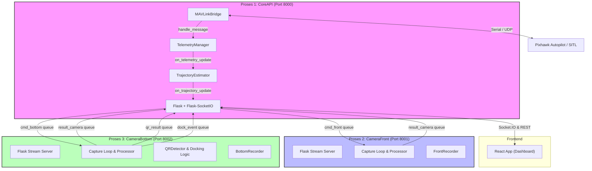

# Dokumentasi Sistem ROV Vision

Dokumen ini berisi analisis mendalam tentang arsitektur kode, alur data (system flow), dokumentasi lengkap untuk REST API & Socket.IO, serta rekomendasi perbaikan teknis untuk sistem kontrol dan visi ROV.

---

## 1. Arsitektur & Analisis Kode Sistem

Sistem ini dirancang menggunakan arsitektur **Multiprocessing** di Python untuk memisahkan beban kerja pemrosesan video berkecepatan tinggi dari penanganan API dan komunikasi MAVLink. Hal ini dilakukan agar latensi frame video tetap rendah dan tidak mengganggu stabilitas kontrol wahana (ROV).



### 1.1. Komponen Utama
Sistem terdiri dari tiga proses mandiri yang dieksekusi dari [main.py](file:///d:/PROJECT%20ROV/rov_system/main.py):

1. **`CoreAPI` (Port 8000)**:
   - Menangani komunikasi web untuk frontend menggunakan **Flask** (untuk HTTP REST API) dan **Flask-SocketIO** (untuk WebSocket real-time).
   - Menjalankan **`MAVLinkBridge`** dalam background thread untuk bertukar data telemetry dan mengirimkan perintah override kontrol (armed, disarmed, flight mode, gripper, lights, RC override) ke Pixhawk/SITL.
   - Menjalankan **`TelemetryManager`** untuk mem-parsing pesan MAVLink mentah menjadi representasi state ROV (pitch, roll, yaw, battery, depth).
   - Menjalankan **`TrajectoryEstimator`** yang mengintegrasikan velocity joystick (dead reckoning) dengan orientasi yaw untuk mengestimasi lintasan koordinat 2D (X, Y) serta kedalaman (depth) ROV secara real-time.
   - Menjalankan **`QueueDrainer`** (tiga thread background) untuk membaca data hasil deteksi QR, event docking, dan status kamera secara non-blocking dari IPC queue.

2. **`CameraFront` (Port 8001)**:
   - Mengambil frame dari kamera depan (`CAMERA_FRONT_INDEX`).
   - Melakukan koreksi warna ringan (boosting warna merah, mereduksi warna biru) dan peningkatan kontras menggunakan metode **CLAHE** (Contrast Limited Adaptive Histogram Equalization) yang telah dioptimalkan untuk kondisi kolam dangkal (1 meter).
   - Menyediakan MJPEG stream melalui HTTP endpoint `/stream`.
   - Mengonsumsi queue perintah screenshot dan perekaman video (`cmd_front`).

3. **`CameraBottom` (Port 8002)**:
   - Mengambil frame dari kamera bawah (`CAMERA_BOTTOM_INDEX`).
   - Mengaktifkan auto-exposure agar gambar adaptif saat mendekati marker dock.
   - Menjalankan **`QRDetector`** menggunakan `pyzbar` secara berkala (dibatasi interval waktu agar menghemat CPU) untuk mendeteksi QR code dan memeriksa apakah ROV sudah ter-align sempurna di atas docking station (pusat QR berada di dalam batas toleransi pusat frame).
   - Menyediakan MJPEG stream dengan HUD penanda docking dan bounding box QR code.
   - Mengonsumsi queue perintah screenshot dan perekaman video (`cmd_bottom`).

---

## 2. Alur Kerja Sistem (System Flow)

### 2.1. Alur Inisialisasi & Startup
1. Operator menjalankan `python main.py`.
2. `main.py` menggunakan start method `spawn` (untuk keamanan multiprocessing pada pustaka OpenCV/Flask) dan menginisialisasi shared queue penampung IPC (Inter-Process Communication) menggunakan `multiprocessing.Manager()`.
3. Tiga proses anak (`CoreAPI`, `CameraFront`, `CameraBottom`) di-spawn.
4. Di dalam `CoreAPI`:
   - `MAVLinkBridge` diluncurkan dalam thread background terpisah (`MAVLinkConnector`) untuk menyambungkan koneksi UDP/Serial ke autopilot secara asinkron agar tidak menahan jalannya inisialisasi server Flask.
   - Thread `QueueDrainer` dimulai untuk secara konstan membaca queue asinkron (`qr_result`, `dock_event`, `result_camera`).
   - Server WebSocket Socket.IO dijalankan di port 8000.
5. Di dalam proses kamera (`CameraFront` & `CameraBottom`):
   - OpenCV membuka antarmuka kamera hardware, mengonfigurasi resolusi dan FPS.
   - Background thread capture loop diluncurkan untuk memproses frame video secara real-time dan merespons antrean perintah (`cmd_front` & `cmd_bottom`).
   - Server Flask mini dijalankan pada masing-masing port (8001 dan 8002) untuk menyajikan MJPEG stream.

### 2.2. Alur Telemetry & Estimasi Trajectory
```
[Pixhawk/SITL]
       │ (Kirim pesan MAVLink: ATTITUDE, SYS_STATUS, etc.)
       ▼
[MAVLinkBridge (Thread Reader)]
       │ (Pesan mentah dilempar ke callback)
       ▼
[TelemetryManager] ──► (Update state internal baterai, orientasi, sensor kedalaman)
       │ (Picu callback on_telemetry_update)
       ▼
[TrajectoryEstimator] ──► (Kalkulasi Dead Reckoning: posisi X/Y/Depth baru)
       │ (Picu callback rate-limited 0.1s)
       ▼
[Socket.IO Emit] ──► (Kirim event 'telemetry_update' & 'trajectory_update') ──► [React Frontend]
```

### 2.3. Alur Kontrol & RC Override (Joystick)
1. Frontend React menangkap input joystick dari operator, lalu mengirimkan event WebSocket `cmd_rc_override` dengan objek data channel PWM.
2. `routes.py` menerima event tersebut:
   - Meneruskan channel PWM ke `MAVLinkBridge.rc_override()` untuk dikirimkan langsung ke Pixhawk sebagai input kontrol motor/thruster.
   - Mengonversi channel pitch dan roll joystick ke representasi kecepatan (m/s) dan memanggil `TrajectoryEstimator.update_velocity(vel_x, vel_y)`.
3. Pada iterasi telemetry berikutnya, `TrajectoryEstimator` menggunakan data kecepatan ini bersama yaw orientasi untuk mengintegrasikan jarak perpindahan koordinat ROV ($\Delta x$, $\Delta y$) berdasarkan interval waktu ($\Delta t$).

### 2.4. Alur Deteksi QR & Docking
1. `CameraBottom` mengambil frame gambar mentah dari sensor bawah.
2. Frame didekatkan ke filter preprocessing (grayscale + adaptive thresholding) untuk memperjelas batas visual QR code.
3. `QRDetector` memindai frame preprocessed dengan pustaka `pyzbar`.
4. Jika QR code terdeteksi:
   - Bounding box digambar di stream MJPEG.
   - Fungsi `_check_alignment` menghitung koordinat titik tengah QR code. Jika jarak antara pusat QR code dengan pusat frame berada di bawah 50 piksel (`DOCK_CENTER_TOLERANCE_PX`), state docking berubah menjadi **`dock_aligned`**. Jika keluar atau QR hilang, state berubah menjadi **`dock_lost`**.
   - Hasil teks QR dimasukkan ke `qr_result_queue`.
   - Event status docking dimasukkan ke `dock_event_queue`.
5. Di proses `CoreAPI`, `QueueDrainer` membaca queue asinkron tersebut:
   - Untuk data QR baru, memanggil callback untuk merekam QR ke history internal (disimpan maksimal 100 riwayat teranyar).
   - Memancarkan event WebSocket `qr_detected`, `dock_aligned`, atau `dock_lost` ke seluruh klien React yang terhubung.

### 2.5. Alur Aksi Kamera (Screenshot & Recording)
1. Frontend mengirimkan HTTP POST request ke endpoint REST (misalnya `POST /api/camera/front/screenshot`).
2. Core API memproses request tersebut di `routes.py` dan memanggil `_send_camera_cmd(camera, action)` yang memasukkan perintah ke shared queue terkait (misal `cmd_front_queue`).
3. Core API langsung memberikan respons HTTP REST `200 OK` (atau `503` jika antrean penuh) tanpa memblokir thread HTTP untuk menunggu hasil proses penyimpanan gambar.
4. Di background capture thread proses kamera, loop utama memanggil `_handle_commands()` secara berkala:
   - Mengambil perintah dari `cmd_queue` secara non-blocking.
   - Mengeksekusi aksi: menyimpan frame mentah tanpa HUD ke disk (`FrontScreenshot` / `BottomScreenshot`) atau memulai/menghentikan objek `cv2.VideoWriter` (`FrontRecorder` / `BottomRecorder`).
5. Setelah file tersimpan atau gagal, proses kamera memasukkan payload status ke `result_camera_queue`.
6. `QueueDrainer` di Core API menarik payload tersebut dan memancarkan event `camera_result` via WebSocket ke frontend agar UI React dapat menampilkan notifikasi visual keberhasilan aksi beserta tautan berkasnya.

---

## 3. Dokumentasi Endpoint API Lengkap

### 3.1. Informasi Dasar Server
* **Core API Server (REST & Socket.IO)**: `http://localhost:8000`
* **Stream Kamera Depan (MJPEG)**: `http://localhost:8001/stream`
* **Stream Kamera Bawah (MJPEG)**: `http://localhost:8002/stream`

---

### 3.2. REST API Endpoints

#### 1. `GET /api/status`
* **Deskripsi**: Mengecek status operasi server utama serta konektivitas MAVLink ke Pixhawk.
* **Headers**: `Content-Type: application/json`
* **Response Contoh (200 OK)**:
  ```json
  {
    "service": "ROV Core API",
    "status": "running",
    "timestamp": "2026-06-27T03:39:22.123456",
    "mavlink": {
      "connected": true
    }
  }
  ```

#### 2. `GET /api/streams`
* **Deskripsi**: Mendapatkan URL streaming video MJPEG beserta endpoint status health dari masing-masing kamera.
* **Response Contoh (200 OK)**:
  ```json
  {
    "front": {
      "stream_url": "http://localhost:8001/stream",
      "health_url": "http://localhost:8001/health"
    },
    "bottom": {
      "stream_url": "http://localhost:8002/stream",
      "health_url": "http://localhost:8002/health"
    }
  }
  ```

#### 3. `GET /api/telemetry`
* **Deskripsi**: Mendapatkan snapshot data telemetry terakhir dari sistem sensor ROV.
* **Response Contoh (200 OK)**:
  ```json
  {
    "roll": 1.25,
    "pitch": -0.84,
    "yaw": 182.4,
    "depth": 1.450,
    "battery_voltage": 16.48,
    "battery_current": 4.21,
    "battery_remaining": 88,
    "lat": -6.2000000,
    "lon": 106.8166660,
    "gps_fix": 3,
    "armed": true,
    "mode": "DEPTH_HOLD",
    "accel_x": 0.012,
    "accel_y": -0.004,
    "accel_z": 0.981,
    "gyro_x": 0.001,
    "gyro_y": 0.000,
    "gyro_z": -0.002,
    "last_update": 1782559162.88
  }
  ```

#### 4. `GET /api/trajectory`
* **Deskripsi**: Mendapatkan snapshot koordinat estimasi posisi saat ini serta array history lintasan (trail) koordinat ROV.
* **Response Contoh (200 OK)**:
  ```json
  {
    "current_pos": {
      "x": 1.425,
      "y": 0.985,
      "depth": 1.450
    },
    "orientation": {
      "roll": 1.25,
      "pitch": -0.84,
      "yaw": 182.4
    },
    "path": [
      {
        "x": 0.0,
        "y": 0.0,
        "depth": 0.0,
        "yaw": 0.0,
        "timestamp": 1782559100.0
      },
      {
        "x": 0.12,
        "y": 0.08,
        "depth": 0.45,
        "yaw": 10.5,
        "timestamp": 1782559105.5
      }
    ],
    "timestamp": 1782559163.12
  }
  ```

#### 5. `POST /api/trajectory/reset`
* **Deskripsi**: Mengatur ulang (reset) koordinat posisi estimasi ROV di `TrajectoryEstimator` kembali ke koordinat origin `(0,0,0)` dan mengosongkan trail path.
* **Response Contoh (200 OK)**:
  ```json
  {
    "message": "Trajectory reset ke origin"
  }
  ```

#### 6. `GET /api/qr/history`
* **Deskripsi**: Mendapatkan riwayat pembacaan QR Code dari kamera bawah (maksimal 50 entri terakhir yang dikembalikan).
* **Response Contoh (200 OK)**:
  ```json
  {
    "count": 2,
    "history": [
      {
        "type": "qr_detected",
        "data": "DOCK_MARKER_01",
        "aligned": false,
        "timestamp": 1782559110.12,
        "received_at": "2026-06-27T03:39:40.123456"
      },
      {
        "type": "qr_detected",
        "data": "DOCK_MARKER_01",
        "aligned": true,
        "timestamp": 1782559115.45,
        "received_at": "2026-06-27T03:39:45.456789"
      }
    ]
  }
  ```

#### 7. `DELETE /api/qr/history`
* **Deskripsi**: Menghapus seluruh riwayat data pemindaian QR Code dari memori server API.
* **Response Contoh (200 OK)**:
  ```json
  {
    "message": "QR history cleared"
  }
  ```

#### 8. `GET /api/health`
* **Deskripsi**: Endpoint pemeriksaan kesehatan sederhana (health check) dari Core API.
* **Response Contoh (200 OK)**:
  ```json
  {
    "status": "ok"
  }
  ```

#### 9. `POST /api/camera/<cam>/screenshot`
* **Deskripsi**: Meminta proses kamera tertentu (`front` atau `bottom`) untuk menyimpan satu snapshot frame mentah (.jpg) tanpa rendering HUD/overlay ke disk.
* **Path Parameters**:
  * `cam`: `front` atau `bottom`
* **Response Contoh (200 OK - Terantre)**:
  ```json
  {
    "camera": "front",
    "action": "screenshot",
    "queued": true,
    "message": "Command 'screenshot' dikirim ke kamera front"
  }
  ```
* **Response Contoh (503 Service Unavailable - Queue Penuh)**:
  ```json
  {
    "camera": "front",
    "action": "screenshot",
    "queued": false,
    "message": "Gagal kirim command: Queue penuh"
  }
  ```
* **Response Contoh (400 Bad Request - Parameter Salah)**:
  ```json
  {
    "error": "camera harus 'front' atau 'bottom'"
  }
  ```

#### 10. `POST /api/camera/<cam>/record/start`
* **Deskripsi**: Memulai proses perekaman video mentah (.mp4) pada kamera tertentu (`front` atau `bottom`).
* **Path Parameters**:
  * `cam`: `front` atau `bottom`
* **Response Contoh (200 OK - Terantre)**:
  ```json
  {
    "camera": "bottom",
    "action": "record_start",
    "queued": true,
    "message": "Command 'record_start' dikirim ke kamera bottom"
  }
  ```

#### 11. `POST /api/camera/<cam>/record/stop`
* **Deskripsi**: Menghentikan proses perekaman video aktif pada kamera tertentu dan menyimpan hasilnya ke disk.
* **Path Parameters**:
  * `cam`: `front` atau `bottom`
* **Response Contoh (200 OK - Terantre)**:
  ```json
  {
    "camera": "front",
    "action": "record_stop",
    "queued": true,
    "message": "Command 'record_stop' dikirim ke kamera front"
  }
  ```

#### 12. `GET http://localhost:8001/health` (Kamera Depan) / `GET http://localhost:8002/health` (Kamera Bawah)
* **Deskripsi**: Endpoint pemantauan langsung pada server stream internal untuk mengecek kondisi hardware sensor kamera OpenCV.
* **Response Contoh (200 OK)**:
  ```json
  {
    "camera": "front",
    "status": "ok",
    "recording": false,
    "record_file": null
  }
  ```

---

### 3.3. WebSocket (Socket.IO) Events

#### 3.3.1. Inbound Events (Klien React ──► Server Core API)

| Nama Event | Payload | Fungsi / Keterangan |
| :--- | :--- | :--- |
| `ping_rov` | `string` / `object` | Melakukan ping tes koneksi. Server akan merespons langsung dengan `pong_rov` yang berisi echo data yang sama. |
| `cmd_arm` | *(kosong / null)* | Mengirimkan perintah arming ke Pixhawk untuk menyalakan motor thruster. |
| `cmd_disarm` | *(kosong / null)* | Mengirimkan perintah disarming ke Pixhawk untuk mematikan motor demi keamanan. |
| `cmd_set_mode`| `{"mode": "DEPTH_HOLD"}` | Mengubah flight mode Pixhawk (e.g. `MANUAL`, `STABILIZE`, `DEPTH_HOLD`, `ALT_HOLD`). |
| `cmd_gripper` | `{"action": "open"}` atau `{"action": "close"}` | Mengontrol gripper lengan mekanik ROV dengan mengatur PWM servo pada channel AUX. |
| `cmd_light` | `{"state": true}` atau `{"state": false}` | Menyalakan atau mematikan lampu sorot utama ROV menggunakan perintah relay Pixhawk. |
| `cmd_rc_override` | `{"channels": {"1": 1500, "2": 1600, ...}}` | Mengesampingkan (override) channel kontrol radio (RC) Pixhawk. Secara bersamaan meng-update velocity input pada `TrajectoryEstimator` untuk mengalkulasi dead reckoning. |

#### 3.3.2. Outbound Events (Server Core API ──► Klien React)

| Nama Event | Payload | Deskripsi / Kondisi Pemicu |
| :--- | :--- | :--- |
| `pong_rov` | `{"echo": <data>}` | Respons balik asinkron atas event `ping_rov` klien. |
| `telemetry_update` | Objek telemetry lengkap (lihat struktur `GET /api/telemetry`) | Dikirim secara broadcast tiap kali ada data status sensor orientasi/telemetry baru ter-parsing dari Pixhawk. |
| `trajectory_update` | Objek trajectory lengkap (lihat struktur `GET /api/trajectory`) | Dikirim secara broadcast maksimal sekali tiap 0.1 detik (`TRAJECTORY_UPDATE_INTERVAL`) yang memuat data trail titik koordinat posisi ROV terbaru. |
| `mavlink_status` | `{"connected": true\|false}` | Menginfokan status koneksi link data serial/UDP antara Core API dengan modul hardware Pixhawk. Dikirimkan saat inisialisasi koneksi awal dan saat status berubah. |
| `qr_detected` | `{"type": "qr_detected", "data": "STRING", "aligned": true\|false, "timestamp": 1234567.89}` | Menginfokan jika kamera bawah mendeteksi adanya QR Code baru yang masuk dalam frame bidik. |
| `dock_aligned` | `{"type": "dock_aligned", "aligned": true, "timestamp": 1234567.89}` | Dikirimkan sekali ketika ROV masuk ke dalam posisi terpusat (aligned) di atas docking station. |
| `dock_lost` | `{"type": "dock_lost", "aligned": false, "timestamp": 1234567.89}` | Dikirimkan sekali ketika alignment posisi ROV bergeser keluar dari area docking station. |
| `camera_result` | `{"camera": "front\|bottom", "action": "screenshot\|record_start\|record_stop", "status": "ok\|error", "filepath": "...", "filename": "..."}` | Mengirimkan laporan hasil aksi asinkron dari proses kamera ke antarmuka operator di frontend. |

---

## 4. Temuan Analisis & Rekomendasi Perbaikan (Saran Perbaikan)

Berdasarkan tinjauan menyeluruh terhadap struktur kode sistem, berikut adalah beberapa temuan kelemahan struktural beserta usulan perbaikan teknis yang konkret:

### 4.1. Pemantauan & Autorestart Proses Anak (Process Recovery)
* **Kelemahan**: Pada file `main.py` baris 156-163, terdapat loop pemantauan status proses anak. Jika proses `CoreAPI`, `CameraFront`, atau `CameraBottom` mengalami *crash* (misal karena kamera USB terputus sementara atau port server bentrok), sistem hanya mencetak log warning (`TODO: implementasi restart logic di sini jika perlu`) tetapi tidak mengambil tindakan penyelematan apa pun. Hal ini membuat sistem ROV tidak handal saat digunakan di lapangan.
* **Saran Perbaikan**: Implementasikan logika *respawning* mandiri dengan pembatasan jumlah percobaan maksimum (*max retries*) untuk mencegah *infinite crash loop* jika terjadi kegagalan hardware permanen.
  ```python
  # Rekomendasi perbaikan pada main.py:
  if not p.is_alive():
      logger.warning(f"[!] Proses '{p.name}' mati (exitcode={p.exitcode}), menghidupkan kembali...")
      # Salin argumen dan target dari konfigurasi asli, lalu spawn ulang proses
      new_p = multiprocessing.Process(target=cfg_target, args=cfg_args, name=p.name, daemon=False)
      new_p.start()
      _processes[idx] = new_p
  ```

### 4.2. Mekanisme Reconnection MAVLink yang Kokoh (Auto-Reconnect)
* **Kelemahan**: Kelas `MAVLinkBridge` dalam `core/mavlink.py` memiliki fungsi retry koneksi sebanyak 12 kali saat inisialisasi awal (`connect()`). Namun, jika koneksi serial/UDP terputus di tengah operasi (misal kabel Pixhawk longgar saat manuver air), thread pembaca `_reader_loop` hanya akan menangkap exception, menampilkan warning log, lalu tidur selama 0.5 detik dalam perulangan tanpa batas tanpa mencoba memanggil prosedur penyambungan ulang (`connect()`) secara utuh. Telemetry pun akan membeku selamanya.
* **Saran Perbaikan**: Modifikasi loop pembacaan MAVLink untuk mendeteksi hilangnya *heartbeat* secara periodik atau kegagalan baca berulang, lalu memicu status `_connected = False` dan menstart ulang proses koneksi di background thread baru tanpa menghentikan core server Flask.

### 4.3. Skalabilitas Penyimpanan Data QR Code
* **Kelemahan**: Riwayat QR code disimpan pada variabel in-memory list (`_qr_history`) di dalam `core/routes.py`. Jika proses `CoreAPI` di-restart, seluruh riwayat pemindaian QR code yang bernilai historis penting selama misi ROV akan langsung hilang.
* **Saran Perbaikan**: Simpan data deteksi ke dalam file lokal terstruktur (e.g. SQLite database mini atau file JSON flat) di dalam direktori `storage/` agar data bersifat persistent dan aman dari crash server.

### 4.4. Validasi Format Payload Payload API & Socket.IO
* **Kelemahan**: REST API dan penangan Socket.IO (`routes.py`) saat ini langsung memproses dictionary input dari klien frontend (misalnya `data.get("mode")` atau `data.get("channels")`) secara mentah tanpa adanya validasi tipe data (type casting) atau penanganan exception yang menyeluruh. Contohnya, jika payload `channels` tidak menyertakan index bertipe integer pada key, pemanggilan parser `int(k)` akan menyebabkan crash internal thread WebSocket.
* **Saran Perbaikan**: Gunakan skema validasi data sederhana (misalnya validasi struktur manual dengan blok `try-except KeyError` yang solid, atau menggunakan pustaka validasi data seperti `pydantic` atau Marshmallow) sebelum data diteruskan ke MAVLink bridge.

### 4.5. Penggunaan Shared Queue `frame_snapshot` yang Terbengkalai
* **Kelemahan**: Pustaka `shared_queue.py` menginisialisasi antrean `frame_snapshot`, namun queue ini tidak pernah di-pass ke proses kamera maupun dibaca oleh Core API di `main.py`.
* **Saran Perbaikan**: Hapus instansiasi `frame_snapshot` jika memang tidak diperlukan untuk merapikan alokasi memory IPC, atau gunakan antrean tersebut untuk mengalirkan frame gambar mentah berukuran kecil dari kamera bawah ke Core API agar API REST `/api/status` dapat memberikan visualisasi status kesehatan visual secara real-time.
