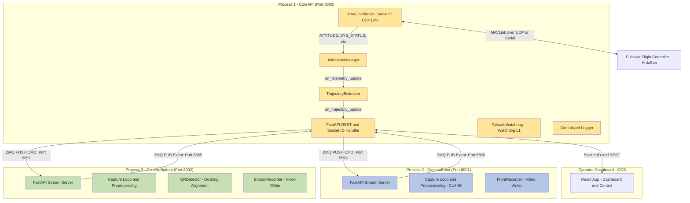
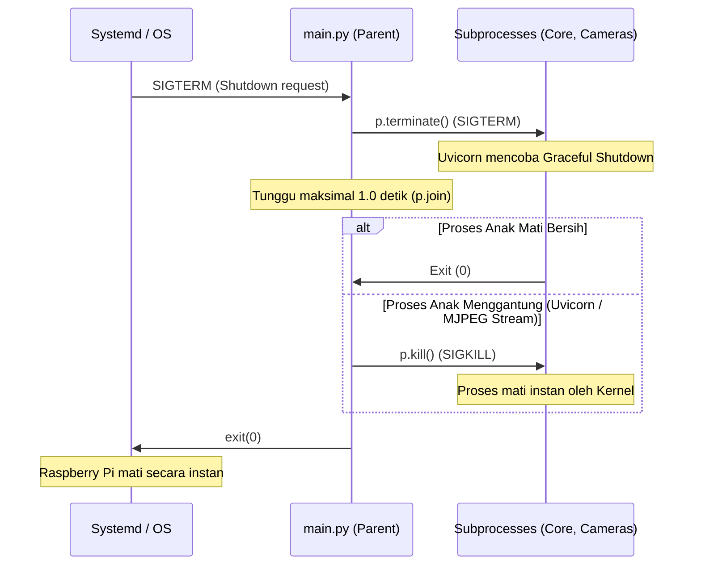

# Dokumentasi Sistem ROV Vision & Control
## Versi 1.2.0 — Perbaikan Latensi Streaming Video & GStreamer (Juli 2026)

Dokumen ini ditujukan sebagai panduan teknis komprehensif bagi **Dosen Pembimbing**, **Divisi Elektronik**, **Embedded System Engineer**, **Frontend Engineer**, serta **Pengembang Penerus** sistem ROV. Dokumen ini menyajikan analisis mendalam tentang arsitektur perangkat lunak, spesifikasi hardware & protokol komunikasi, alur kerja sistem (*data flow*), detail antarmuka REST API & Socket.IO, sistem keamanan (*failsafe*), serta layanan logging terpusat.

---

## 1. Arsitektur Perangkat Lunak (Software Architecture)

Sistem dirancang dengan arsitektur **Multiprocessing** berbasis Python untuk memisahkan proses-proses kritis. Pemisahan ini mencegah latensi pemrosesan video berkecepatan tinggi mempengaruhi stabilitas kontrol wahana (ROV) dan pengiriman perintah MAVLink.

### 1.1. Diagram Blok Arsitektur Sistem



### 1.2. Model Multiprocessing "Spawn"
Sistem secara eksplisit memanggil `multiprocessing.set_start_method("spawn", force=True)` di awal program. Hal ini sangat penting pada sistem berbasis Unix (seperti Raspberry Pi OS) karena metode default `fork` dapat menyebabkan deadlock pada pemanggilan library internal C/C++ seperti OpenCV, CUDA, driver kamera UVC, serta binding socket ganda FastAPI/Uvicorn. Dengan metode `spawn`, setiap sub-proses dimulai dengan interpreter Python yang segar dan bersih.

### 1.3. Pembagian Peran Komponen

#### 1. Proses CoreAPI (`main.py` -> `run_core_server`)
Proses utama yang mengendalikan siklus hidup ROV dan jembatan ke operator:
- **FastAPI & Socket.IO**: Melayani permintaan HTTP REST dan komunikasi dupleks penuh (*full-duplex*) berlatensi rendah ke dashboard operator React.
- **`MAVLinkBridge`**: Beroperasi di thread latar belakang untuk menjalin koneksi serial/UDP ke Pixhawk. Mengirimkan sinyal kendali seperti override RC channel (motor), arm/disarm, mode terbang, servo gripper, dan relay lampu.
- **`TelemetryManager`**: Memilah (*parse*) frame pesan biner MAVLink (seperti `ATTITUDE`, `SYS_STATUS`, `BATTERY_STATUS`, `SCALED_PRESSURE2`, `HEARTBEAT`) menjadi state dictionary Python yang siap dikonsumsi UI.
- **`TrajectoryEstimator`**: Melakukan perhitungan posisi estimasi (*dead reckoning*) berbasis integrasi matematika kecepatan masukan joystick terhadap orientasi yaw kompas Pixhawk dan pembacaan sensor kedalaman (*depth*).
- **`FailsafeWatchdog`**: Mengawasi kesehatan operasional seluruh modul (watchdog level Pi) dan mengeksekusi mitigasi bencana/kegagalan sistem secara otonom.

#### 2. Proses CameraFront (`main.py` -> `run_front_stream_server`)
- Mengambil bingkai gambar (*frame*) dari sensor kamera depan.
- Menerapkan manipulasi gambar real-time: CLAHE (*Contrast Limited Adaptive Histogram Equalization*) dan koreksi warna (*boosting* warna merah, reduksi warna biru) untuk menembus keterbatasan jarak pandang kolam.
- Menyajikan aliran video (*video stream*) berbasis protokol WebRTC untuk latensi rendah (port `8001/offer`) dengan fallback ke MJPEG (port `8001/stream`).
- Memproses antrean perintah screenshot dan perekaman video (`cmd_front`).

#### 3. Proses CameraBottom (`main.py` -> `run_bottom_stream_server`)
- Mengambil frame dari sensor kamera bawah.
- Menerapkan auto-exposure dinamik agar marker target tidak mengalami *over-exposure* akibat paparan lampu.
- Menjalankan **`QRDetector`** (`pyzbar`/`wechat_qrcode`) secara berkala untuk mendeteksi QR code dan menghitung deviasi jarak titik pusat QR terhadap pusat frame kamera guna menentukan tingkat kelurusan (*docking alignment*).
- Menyediakan WebRTC stream (port `8002/offer`) dan MJPEG stream (port `8002/stream`) lengkap dengan HUD overlay status alignment dan bounding box QR code.

### 1.4. Komunikasi Antar-Proses (ZeroMQ IPC)
Untuk meminimalkan interferensi antar-proses, sistem tidak menggunakan Shared Memory bawaan Python yang lambat, melainkan menggunakan **ZeroMQ (ZMQ)**:
- **Command Path (PUSH/PULL)**: `CoreAPI` mengikat (*bind*) socket PUSH pada port `5558` (depan) dan `5557` (bawah) untuk mengirim perintah asinkron seperti screenshot dan perintah rekam. Proses kamera bertindak sebagai PULL client yang mendengarkan perintah tersebut secara non-blocking.
- **Event Path (PUB/SUB)**: Proses kamera mengikat (*bind*) socket PUB pada port `5556` (depan) dan `5555` (bawah). `CoreAPI` bertindak sebagai SUB client untuk menangkap hasil scan QR (`qr_result`), status alignment (`dock_event`), serta laporan selesai rekam (`camera_result`).

### 1.5. Layanan Autostart (Systemd Service)
Pada Raspberry Pi 5, sistem berjalan otomatis saat boot menggunakan **systemd service** yang ditempatkan di `/etc/systemd/system/rov.service`.

```ini
[Unit]
Description=ROV Vision & Control System Service
After=network.target network-online.target
Wants=network-online.target

[Service]
WorkingDirectory=/home/pi/rov_revisi_stream
ExecStart=/home/pi/rov_revisi_stream/.venv/bin/python main.py
User=pi
Group=pi
Restart=always
RestartSec=5
Environment=PYTHONUNBUFFERED=1
TimeoutStopSec=3

[Install]
WantedBy=multi-user.target
```
*Catatan: `TimeoutStopSec=3` dikonfigurasi untuk mencegah systemd menunggu default 90 detik saat proses shutdown terhambat oleh koneksi HTTP kamera.*

---

## 2. Alur Kerja & Protokol Keamanan (System Data Flow & Safety)

### 2.1. Alur Startup & Inisialisasi Proses
1. Layanan `rov.service` dijalankan saat boot.
2. Interpreter memanggil [main.py](file:///d:/PROJECT%20ROV/rov_revisi_stream/main.py), menginisialisasi logging terpusat (`setup_logging()`), dan mengatur metode startup ke `spawn`.
3. Tiga proses utama (`CoreAPI`, `CameraFront`, `CameraBottom`) di-spawn.
4. `CoreAPI` menjalankan daemon thread `MAVLinkConnector` untuk mendeteksi port Pixhawk secara asinkron.
5. `CoreAPI` memulai `start_zmq_listener` di dalam loop `asyncio` untuk mengambil data dari proses kamera dan meneruskannya ke Socket.IO React client.

### 2.2. Alur Shutdown Cepat & Aman (SIGTERM & SIGKILL Fallback)
Saat Raspberry Pi dimatikan (*poweroff* atau *reboot*), systemd mengirimkan sinyal `SIGTERM` ke seluruh grup proses. Untuk mencegah program menggantung akibat koneksi MJPEG yang tidak pernah ditutup oleh client, diimplementasikan mekanisme shutdown bertingkat di [main.py](file:///d:/PROJECT%20ROV/rov_revisi_stream/main.py):



Jika salah satu proses anak mati secara tidak terduga saat operasi normal berjalan, monitor loop pada `main.py` akan segera menangkap status tersebut dan memicu fungsi `_shutdown` global untuk keluar secara total. Hal ini memicu Systemd me-restart seluruh program dari awal agar sistem tidak berjalan pincang.

### 2.3. Alur Keamanan: Watchdog & Failsafe (`failsafe.py`)
Failsafe watchdog bertindak sebagai asuransi keamanan fisik hardware ROV dengan memantau metrik berikut setiap `FS_CHECK_INTERVAL` (2.0 detik):

| Komponen Diawasi | Metode Pengecekan | Batas Toleransi (*Timeout*) | Severity jika Gagal | Aksi Pemulihan (*Recovery Action*) |
| :--- | :--- | :--- | :--- | :--- |
| **MAVLink Link** | Deteksi paket HEARTBEAT Pixhawk | `5.0` detik | **CRITICAL** | Berpindah ke mode terbang **MANUAL**, set PWM input ke posisi netral (`1500`), lalu jalankan re-koneksi serial di background. |
| **Dashboard** | Check jumlah active WebSocket clients | `30.0` detik | **WARNING** | Melakukan pemantauan intensif. Jika terus-menerus kosong, asumsikan putus kabel tether. |
| **Telemetry** | Waktu pembaruan dictionary state terakhir | `5.0` detik | **CRITICAL** | Set kontrol PWM motor ke netral (`1500`) agar ROV tidak bergerak liar. |
| **Camera Front** | HTTP Request `/health` ke port 8001 | `2.0` detik | **WARNING** | Log error, catat anomali untuk GCS. |
| **Camera Bottom** | HTTP Request `/health` ke port 8002 | `2.0` detik | **WARNING** | Nonaktifkan opsi auto-docking di backend. |
| **System Temp** | Membaca sensor termal Pi (`/sys/class/thermal`) | `> 70` °C | **CRITICAL** | Mengurangi frekuensi scan QR untuk memotong beban panas CPU. |
| **CPU / RAM** | Membaca utilisasi via `psutil` | `> 85` % | **WARNING** | Menurunkan prioritas pemrosesan visual non-kritis. |

#### Definisi Level Severity:
1. **INFO (0)**: Operasi normal.
2. **WARNING (1)**: Kerusakan minor. Mencoba pemulihan otomatis (*auto-recovery*) di background.
3. **CRITICAL (2)**: Pemulihan gagal setelah `FS_MAX_RECOVERY_ATTEMPTS = 3`. Kendali ROV dinetralkan, Pixhawk dipaksa ke mode **MANUAL** agar ROV mengapung stabil.
4. **EMERGENCY (3)**: Pemicuan manual oleh operator (E-Stop) atau kegagalan sistem fatal beruntun. Pixhawk langsung di-**DISARM** (semua motor mati seketika) dan dashboard menampilkan status alarm merah terkunci.

### 2.4. Logika Misi Otonom & Alignment QR Code (`autonomous.py`)
Layanan otonom mengendalikan ROV untuk mengikuti lintasan yang direkam dan melakukan docking presisi:
1. **Waypoint Replay**: Backend menyuplai instruksi kendali ke Pixhawk dengan mencocokkan koordinat estimasi saat ini terhadap koordinat waypoint rekaman. Kecepatan dikontrol oleh `AUTONOMOUS_REPLAY_SPEED_PWM` (1580).
2. **QR Code Fine-Alignment**: Ketika kamera bawah mendeteksi QR code target, sistem memasuki mode alignment:
   * Koordinat offset ($X_{offset}, Y_{offset}$) dari pusat QR ke pusat frame dihitung.
   * Koreksi translasi lateral (CH1) dihitung menggunakan kontrol proporsional:
     $$\Delta \text{PWM}_{\text{lateral}} = X_{offset} \times \text{AUTONOMOUS\_KP\_ALIGN\_LATERAL}$$
   * Koreksi rotasi yaw (CH4) dibantu menggunakan parameter `AUTONOMOUS_KP_ALIGN_YAW`.
3. **Pickup / Docking Sequence**: Setelah ROV lurus terhadap QR ($\le 30\text{ px}$ offset), ROV maju secara perlahan, membuka gripper (`cmd_gripper` open), menunggu waktu delay, menjepit target, lalu melakukan mode kembali (*Return to Home*).

---

## 3. Spesifikasi Perangkat Keras & Protokol (Elektronik & Embedded)

### 3.1. Hubungan Kabel & Antarmuka Fisik (Wiring & Interface)

```
       +--------------------+                    +-------------------+
       |  Laptop GCS (UI)   |                    | Pixhawk Autopilot |
       +---------+----------+                    +---------+---------+
                 | (Ethernet Tether)                       |
                 | (Slip-Ring)                             | MAVLink v2.0
       +---------+----------+                              | (USB / Serial)
       | Raspberry Pi 5     +------------------------------+
       | (Companion PC)     |
       +----+----------+----+
            |          |
   (USB 0)  |          | (USB 1)
       +----+---+  +---+----+
       | Kamera |  | Kamera |
       | Depan  |  | Bawah  |
       +--------+  +--------+
```

- **Raspberry Pi 5 (Companion PC)**: Disarankan ditenagai menggunakan regulator tegangan **UBEC 5V 5A** langsung ke pin GPIO untuk mencegah *low-voltage throttling* akibat konsumsi daya puncak CPU dan 2 kamera USB secara bersamaan.
- **Datalink Fisik**:
  * Kabel USB-to-MicroUSB terhubung dari port USB Raspberry Pi 5 ke port USB utama Pixhawk.
  * *Alternatif Serial*: Port GPIO UART Raspberry Pi (Pin 14/TX, Pin 15/RX) dihubungkan ke port `TELEM1`/`TELEM2` Pixhawk melalui konverter level logika 3.3V ke 5V.
- **Koneksi Kamera**: Kamera UVC USB terhubung ke port USB 3.0 (warna biru) Raspberry Pi 5 untuk bandwidth transmisi data frame yang stabil.

### 3.2. Protokol Komunikasi MAVLink
- **Connection String**: Diatur pada `config.py` sebagai `udp:0.0.0.0:14550` (jika menggunakan proxy routing) atau langsung port serial `/dev/ttyACM0` dengan Baudrate `115200` bps.
- **Konfigurasi Autopilot (ArduSub)**:
  * Parameter `SERIAL1_PROTOCOL` / `SERIAL2_PROTOCOL` diset ke `1` (MAVLink v1) atau `2` (MAVLink v2).
  * Parameter `SR1_EXTRA1` dan `SR1_POSITION` dikonfigurasi pada Pixhawk untuk mengirim data telemetry sikap (*attitude*) dan koordinat minimal pada frekuensi **20Hz**.

---

## 4. Dokumentasi API Lengkap (API Reference)

### 4.1. HTTP REST API

#### 1. Status Utama
`GET /api/status`
- **Respons (200 OK)**:
  ```json
  {
    "service": "ROV Core API",
    "status": "running",
    "timestamp": "2026-07-11T11:05:00.123456Z",
    "mavlink": { "connected": true }
  }
  ```

#### 2. Konfigurasi Endpoint Video Stream
`GET /api/streams`
- **Respons (200 OK)**:
  ```json
  {
    "front": {
      "stream_url": "http://localhost:8001/stream",
      "webrtc_url": "http://localhost:8001/offer",
      "health_url": "http://localhost:8001/health"
    },
    "bottom": {
      "stream_url": "http://localhost:8002/stream",
      "webrtc_url": "http://localhost:8002/offer",
      "health_url": "http://localhost:8002/health"
    }
  }
  ```

#### 3. Snapshot Telemetri Terakhir
`GET /api/telemetry`
- **Respons (200 OK)**:
  ```json
  {
    "roll": 1.25,
    "pitch": -0.82,
    "yaw": 180.45,
    "depth": 1.48,
    "battery_voltage": 14.78,
    "battery_current": 4.89,
    "battery_remaining": 78,
    "lat": 0.0,
    "lon": 0.0,
    "gps_fix": 0,
    "armed": true,
    "mode": "ALT_HOLD",
    "accel_x": 0.01,
    "accel_y": -0.02,
    "accel_z": 0.98,
    "gyro_x": 0.0,
    "gyro_y": 0.0,
    "gyro_z": 0.0,
    "last_update": 1783782945.12
  }
  ```

#### 4. Kontrol Kamera (Screenshot & Rekaman)
- **POST `/api/camera/{cam}/screenshot`** -> Mengambil screenshot frame.
- **POST `/api/camera/{cam}/record/start`** -> Memulai perekaman video.
- **POST `/api/camera/{cam}/record/stop`** -> Menghentikan perekaman video.

*Path Parameter `{cam}` harus bernilai `front` atau `bottom`.*
- **Respons Umum (200 OK)**:
  ```json
  {
    "camera": "front",
    "action": "screenshot",
    "queued": true,
    "message": "Command 'screenshot' dikirim ke kamera front"
  }
  ```

#### 5. Riwayat Scan QR Code
`GET /api/qr/history`
- **Respons (200 OK)**:
  ```json
  {
    "count": 2,
    "history": [
      {
        "data": "DOCKING_STATION_A",
        "aligned": true,
        "offset_x": 12,
        "offset_y": -5,
        "received_at": "2026-07-11T11:02:15.543210Z"
      }
    ]
  }
  ```

`DELETE /api/qr/history`
- **Respons (200 OK)**:
  ```json
  { "message": "QR history cleared" }
  ```

#### 6. Status Keamanan (Failsafe)
`GET /api/failsafe/status`
- **Respons (200 OK)**:
  ```json
  {
    "overall_severity": "INFO",
    "system_health": {
      "cpu_percent": 34.5,
      "ram_percent": 42.1,
      "temp_celsius": 52.0
    },
    "subsystems": {
      "mavlink": { "status": "OK", "last_heartbeat": 0.4 },
      "dashboard": { "status": "OK", "active_clients": 1 },
      "camera_front": { "status": "OK", "ping_time_ms": 12.5 },
      "camera_bottom": { "status": "OK", "ping_time_ms": 14.1 }
    }
  }
  ```

---

### 4.2. WebSocket API (Socket.IO)

#### 4.2.1. Event Masuk (React Dashboard -> CoreAPI)
- `cmd_arm` / `cmd_disarm`: Mengaktifkan atau menonaktifkan motor penggerak ROV.
- `cmd_set_mode`: Payload `{ "mode": "MANUAL" | "DEPTH_HOLD" | "STABILIZE" }`.
- `cmd_gripper`: Payload `{ "action": "open" | "close" }` -> Mengirim perintah PWM ke servo gripper.
- `cmd_light`: Payload `{ "state": true | false }` -> Menyalakan atau mematikan lampu utama via Relay.
- `cmd_rc_override`: Payload override channel manual (PWM 1100–1900):
  ```json
  {
    "channels": {
      "1": 1500,
      "2": 1600,
      "3": 1500,
      "4": 1500
    }
  }
  ```
- `cmd_emergency_stop`: Payload `{ "reason": "Operator E-Stop" }` -> Mematikan motor seketika (*disarm* paksa).
- `cmd_autonomous_start`: Payload `{ "target_id": "TARGET_A" }` -> Memulai misi otonom mengikuti lintasan.
- `cmd_autonomous_stop`: Membatalkan misi otonom secara paksa dan mengembalikan kendali manual ke operator.

#### 4.2.2. Event Keluar (CoreAPI -> React Dashboard)
- `telemetry_update`: Dikirim pada frekuensi **10Hz** berisi payload dictionary telemetri lengkap.
- `trajectory_update`: Dikirim berkala berisi koordinat estimasi pergerakan ROV saat ini.
- `mavlink_status`: Payload `{ "connected": true | false }`.
- `failsafe_event`: Alert jika terjadi perubahan status keparahan keamanan.
- `camera_result`: Payload konfirmasi penyimpanan file:
  ```json
  {
    "camera": "front",
    "action": "record_stop",
    "status": "ok",
    "filepath": "storage/recordings/front_20260711_110200.mp4",
    "filename": "front_20260711_110200.mp4"
  }
  ```

---

## 5. Optimalisasi Kinerja & Pengurangan Beban CPU (Optimization)

Sistem telah dioptimalkan secara mendalam agar Raspberry Pi 5 dapat memproses data video dan telemetry secara real-time tanpa mengalami panas berlebih (*overheating*):

### 5.1. Operasi Array In-Place (Kamera Depan)
Untuk memotong beban pembersihan alokasi memori (*Garbage Collector*), proses manipulasi citra menghindari pembuatan objek matriks NumPy baru:
- Modifikasi channel warna merah dan biru dilakukan langsung (*in-place*) pada array gambar asli:
  ```python
  frame[:, :, 2] = cv2.add(frame[:, :, 2], COLOR_CORRECTION_RED_BOOST)
  frame[:, :, 0] = cv2.subtract(frame[:, :, 0], COLOR_CORRECTION_BLUE_REDUCE)
  ```
- Penerapan CLAHE menggunakan target penulisan buffer langsung (`dst=frame`):
  ```python
  clahe.apply(l_channel, dst=l_channel)
  ```

### 5.2. WeChat QR Code Detector Optimization (Kamera Bawah)
Mendeteksi QR Code menggunakan WeChat CNN model sangat membebani CPU. Untuk mengatasinya, diterapkan teknik optimasi berikut:
* **Throttling Frekuensi Scan**: QR Detector tidak dijalankan pada setiap frame video (15 FPS), melainkan dibatasi hanya berjalan setiap `QR_SCAN_INTERVAL_MS = 200` ms (5Hz).
* **Grayscale Input**: WeChat QR model dikonfigurasi untuk memproses frame **grayscale 1-channel** hasil konversi, memotong beban komputasi Convolutional Neural Network hingga 3x lipat dibanding memproses frame warna BGR 3-channel asli.

### 5.3. Throttling Emisi Telemetri WebSocket
Untuk mencegah tersumbatnya bandwidth transmisi tethering kabel LAN akibat pengiriman ratusan paket JSON per detik dari PyMAVLink ke dashboard operator:
* PyMAVLink dan estimator lintasan (`TrajectoryEstimator`) tetap membaca data telemetry pada frekuensi tinggi (**50Hz**) di dalam loop internal agar perhitungan integrasi posisi tetap presisi.
* Namun, emisi data ke UI React via Socket.IO dibatasi maksimal hanya **10Hz** menggunakan pencatatar timestamp dan thread-lock di `core/routes.py`.

### 5.4. Pengurangan Latensi Video (Optimasi GStreamer & WebRTC)
Untuk memotong delay konstan (~1 detik) pada feed video, diimplementasikan optimasi berikut:
* **Antrian Non-blocking GStreamer (`appsink`)**: Pipeline GStreamer pada camera wrapper ditambahkan properti `appsink drop=true max-buffers=1 sync=false`. Hal ini memaksa driver kamera untuk mendrop frame lama di buffer memori jika terjadi perlambatan pemrosesan gambar, menjamin OpenCV selalu membaca frame paling aktual (real-time).
* **Pacing Asinkron WebRTC**: Menghapus delay manual `asyncio.sleep` pada loop `MediaStreamTrack` WebRTC. Penjadwalan frame diserahkan sepenuhnya ke fungsi `next_timestamp()` bawaan `aiortc` untuk menghindari penundaan ganda (double pacing/latency) yang menyebabkan penumpukan frame di sisi frontend browser.

---

## 6. Panduan Pemeliharaan & Troubleshooting (Dev Guide)

### 6.1. Pengaturan Virtual Environment (PEP 668)
Raspberry Pi OS Bookworm melarang instalasi package global via `pip install`. Anda wajib menggunakan virtual environment:
```bash
cd /home/pi/rov_revisi_stream
python -m venv .venv
source .venv/bin/activate
pip install -r requirements.txt
```

### 6.2. Perintah Manajemen Layanan Systemd
Gunakan perintah berikut di terminal Raspberry Pi 5:
* **Melihat log real-time**:
  ```bash
  journalctl -u rov.service -f -n 100
  ```
* **Menghentikan Layanan**:
  ```bash
  sudo systemctl stop rov.service
  ```
* **Menjalankan Layanan**:
  ```bash
  sudo systemctl start rov.service
  ```
* **Melihat status aktif**:
  ```bash
  sudo systemctl status rov.service
  ```

### 6.3. Troubleshooting Masalah Umum
1. **MAVLink Tidak Terhubung**:
   * *Solusi*: Pastikan parameter port serial di `config.py` sesuai (misal `/dev/ttyACM0` atau `/dev/ttyUSB0`). Gunakan perintah `ls /dev/tty*` untuk memverifikasi pendeteksian perangkat USB.
2. **Kamera Tidak Terdeteksi**:
   * *Solusi*: Jalankan `v4l2-ctl --list-devices` untuk melihat nomor index hardware kamera. Sesuaikan nilai `CAMERA_FRONT_INDEX` dan `CAMERA_BOTTOM_INDEX` di `config.py` jika terbalik.
3. **Umpan Video Delay Tinggi**:
   * *Solusi*: Pastikan properti `appsink drop=true max-buffers=1 sync=false` aktif di pipeline kamera untuk mendrop frame lama. Anda juga dapat menurunkan `MJPEG_QUALITY` di `config.py` menjadi 25 untuk mengurangi beban bandwidth kabel tether jika jaringan lambat.
4. **Log Error "Address already in use"**:
   * *Solusi*: Terjadi bentrokan port karena service lama masih menggantung. Hentikan paksa seluruh proses python tersisa dengan perintah:
     ```bash
     sudo killall -9 python python3
     ```
     Lalu jalankan kembali `sudo systemctl start rov.service`.